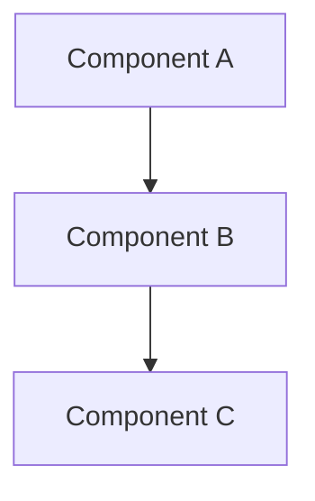

# /aidlc-design - Application Design

Design application components and services.

## What This Command Does

1. **Identify Components**
   - Main components and responsibilities
   - Component interfaces
   - Service layer for orchestration

2. **Define Methods**
   - Method signatures
   - Input/output types
   - High-level purpose

3. **Map Dependencies**
   - Component relationships
   - Communication patterns
   - Dependency graph

## Output Files

```
aidlc-docs/inception/application-design/
├── components.md
├── component-methods.md
├── services.md
└── component-dependency.md
```

## Components Format

```markdown
## Component: {Name}

| Attribute | Description |
|-----------|-------------|
| **Purpose** | {what it does} |
| **Responsibilities** | {list} |
| **Interface** | {type} |
```

## Dependency Diagram



## Completion Options

- **Request Changes** - Modify design
- **Approve & Continue** - Proceed to Units Generation

## Related Commands

- `/aidlc-units` - Units generation
- `/aidlc-plan` - View execution plan

