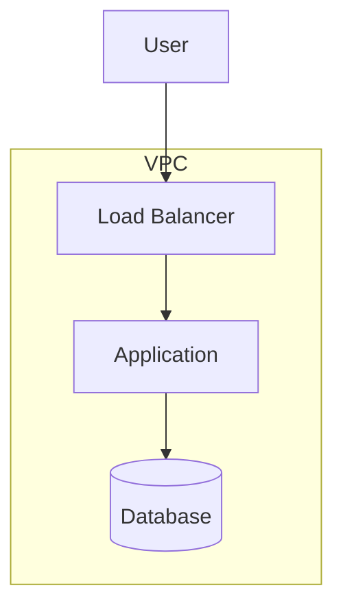

# /aidlc-infra - Infrastructure Design

Design infrastructure and deployment architecture.

## When To Use

**Execute IF:**
- Cloud deployment required
- Infrastructure as Code needed
- Complex deployment architecture
- Multiple environments needed

**Skip IF:**
- Local/development only
- No cloud infrastructure
- Simple deployment

## What This Command Does

1. **Map Infrastructure Services**
   - Compute services
   - Storage services
   - Networking
   - Security services

2. **Design Deployment Architecture**
   - Environment configurations
   - CI/CD pipeline
   - Scaling strategy

## Output Files

```
aidlc-docs/construction/{unit-name}/infrastructure-design/
├── infrastructure-design.md
└── deployment-architecture.md
```

## Architecture Diagram



## Environment Configuration

| Environment | Purpose | Resources |
|-------------|---------|-----------|
| Development | Local testing | Minimal |
| Staging | Pre-prod testing | Medium |
| Production | Live traffic | Full |

## Related Commands

- `/aidlc-code` - Code generation
- `/aidlc-build` - Build and test

