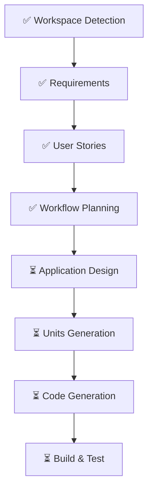

# /aidlc-plan - Workflow Planning

Create execution plan for the AIDLC workflow.

## What This Command Does

1. **Load Context**
   - Requirements document
   - User stories (if available)
   - Reverse engineering artifacts (if brownfield)

2. **Analyze Impact**
   - User-facing changes
   - Structural changes
   - Data model changes
   - API changes
   - NFR impact

3. **Determine Stages**
   - Which stages to EXECUTE
   - Which stages to SKIP
   - Rationale for each decision

4. **Generate Visualization**
   - Mermaid flowchart of workflow
   - Phase status indicators

## Output Files

```
aidlc-docs/inception/plans/
├── workflow-planning.md
└── execution-plan.md
```

## Workflow Visualization Example



## Completion Options

- **Request Changes** - Modify plan
- **Add Skipped Stages** - Include stages marked as SKIP
- **Approve & Continue** - Proceed to Application Design

## Related Commands

- `/aidlc-design` - Application design
- `/aidlc-status` - View current status

