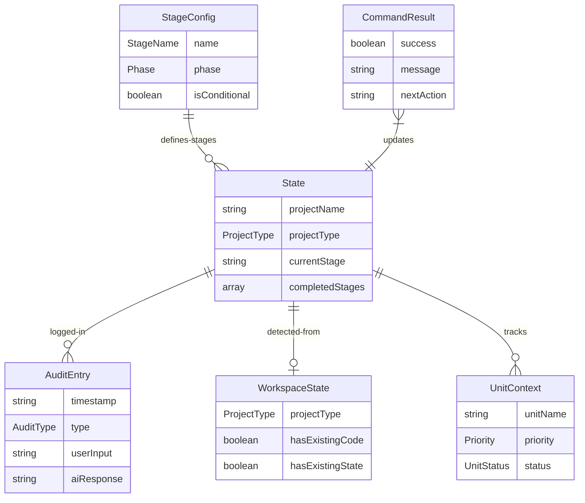

# Domain Entities: Unit 1 - Core Infrastructure

## Overview

Domain entities และ data structures ที่ใช้ใน Core Infrastructure

---

## Entity 1: State

### Definition
```typescript
interface State {
    // Project Information
    projectName: string;
    projectType: ProjectType;
    startDate: string;  // ISO 8601
    currentStage: StageName;
    
    // Progress Tracking
    completedStages: StageName[];
    skippedStages: StageName[];
    
    // Unit Tracking (CONSTRUCTION phase)
    currentUnit?: string;
    completedUnits?: string[];
    
    // Session Info
    lastModified: string;  // ISO 8601
}

type ProjectType = 'greenfield' | 'brownfield';

type StageName = 
    | 'workspace-detection'
    | 'reverse-engineering'
    | 'requirements-analysis'
    | 'user-stories'
    | 'workflow-planning'
    | 'application-design'
    | 'units-generation'
    | 'functional-design'
    | 'nfr-requirements'
    | 'nfr-design'
    | 'infrastructure-design'
    | 'code-generation'
    | 'build-and-test';
```

### Example
```markdown
# AI-DLC State Tracking

## Project Information
- **Project Name**: AIDLC Command System
- **Project Type**: Greenfield
- **Start Date**: 2025-12-15T00:00:00Z
- **Current Stage**: CONSTRUCTION - Functional Design

## Stage Progress
### 🔵 INCEPTION PHASE
- [x] Workspace Detection
- [ ] Reverse Engineering (SKIPPED)
- [x] Requirements Analysis
- [x] User Stories
- [x] Workflow Planning
- [x] Application Design
- [x] Units Generation

### 🟢 CONSTRUCTION PHASE
- [ ] Functional Design (Unit 1)
...
```

---

## Entity 2: AuditEntry

### Definition
```typescript
interface AuditEntry {
    timestamp: string;  // ISO 8601
    type: AuditType;
    stageName?: string;
    userInput?: string;
    aiResponse?: string;
    action?: string;
    details?: Record<string, any>;
    context: string;
}

type AuditType = 
    | 'USER_INPUT'
    | 'AI_ACTION'
    | 'STAGE_TRANSITION'
    | 'APPROVAL'
    | 'ERROR';
```

### Example
```markdown
## INCEPTION - Requirements Approval
**Timestamp**: 2025-12-15T00:02:00Z
**User Input**: "Approve"
**AI Response**: Requirements approved, proceeding to User Stories stage
**Context**: Requirements Analysis Step 9 - User approved requirements

---
```

---

## Entity 3: WorkspaceState

### Definition
```typescript
interface WorkspaceState {
    projectType: ProjectType;
    hasExistingState: boolean;
    hasExistingCode: boolean;
    existingLanguages?: string[];
    existingBuildSystem?: string;
    aidlcRulesPresent: boolean;
}
```

### Detection Logic
```
IF aidlc-state.md EXISTS:
    hasExistingState = true
    // Resume from existing state
ELSE:
    hasExistingState = false
    
IF source files (.ts, .js, .py, etc.) EXIST:
    hasExistingCode = true
    projectType = 'brownfield'
ELSE:
    hasExistingCode = false
    projectType = 'greenfield'
```

---

## Entity 4: StageConfig

### Definition
```typescript
interface StageConfig {
    name: StageName;
    displayName: string;
    phase: Phase;
    isConditional: boolean;
    condition?: ConditionalCheck;
    prerequisites: StageName[];
    artifacts: string[];  // Files generated
    perUnit: boolean;  // Executes per unit in CONSTRUCTION
}

type Phase = 'INCEPTION' | 'CONSTRUCTION' | 'OPERATIONS';

interface ConditionalCheck {
    type: 'projectType' | 'userChoice' | 'requirementExists';
    value: any;
}
```

### Stage Registry
```typescript
const STAGE_REGISTRY: StageConfig[] = [
    {
        name: 'workspace-detection',
        displayName: 'Workspace Detection',
        phase: 'INCEPTION',
        isConditional: false,
        prerequisites: [],
        artifacts: ['aidlc-state.md', 'audit.md'],
        perUnit: false
    },
    {
        name: 'reverse-engineering',
        displayName: 'Reverse Engineering',
        phase: 'INCEPTION',
        isConditional: true,
        condition: { type: 'projectType', value: 'brownfield' },
        prerequisites: ['workspace-detection'],
        artifacts: ['inception/reverse-engineering/*.md'],
        perUnit: false
    },
    {
        name: 'requirements-analysis',
        displayName: 'Requirements Analysis',
        phase: 'INCEPTION',
        isConditional: false,
        prerequisites: ['workspace-detection'],
        artifacts: ['inception/requirements/requirements.md'],
        perUnit: false
    },
    // ... more stages
    {
        name: 'code-generation',
        displayName: 'Code Generation',
        phase: 'CONSTRUCTION',
        isConditional: false,
        prerequisites: ['units-generation'],
        artifacts: ['construction/{unit-name}/code/*'],
        perUnit: true
    }
];
```

---

## Entity 5: CommandResult

### Definition
```typescript
interface CommandResult {
    success: boolean;
    message: string;
    stage?: StageName;
    artifacts?: string[];
    nextAction?: string;
    error?: ErrorInfo;
}

interface ErrorInfo {
    code: string;
    message: string;
    suggestion?: string;
}
```

### Example Results
```typescript
// Success
{
    success: true,
    message: "Requirements Analysis complete",
    stage: "requirements-analysis",
    artifacts: ["inception/requirements/requirements.md"],
    nextAction: "Proceed to User Stories"
}

// Error
{
    success: false,
    message: "Cannot initialize AIDLC",
    error: {
        code: "E_PERMISSION",
        message: "Cannot write to workspace",
        suggestion: "Check file permissions for .cursor/rules/"
    }
}
```

---

## Entity 6: UnitContext

### Definition
```typescript
interface UnitContext {
    unitName: string;
    displayName: string;
    priority: Priority;
    components: string[];
    stories: string[];
    dependencies: string[];  // Other units this depends on
    estimatedLOC: number;
    status: UnitStatus;
}

type Priority = 'P0' | 'P1' | 'P2';
type UnitStatus = 'pending' | 'in-progress' | 'completed';
```

### Example
```typescript
{
    unitName: "unit-1-core-infrastructure",
    displayName: "Core Infrastructure",
    priority: "P0",
    components: ["StateManager", "AuditLogger", "FileManager"],
    stories: [],  // Internal, no direct stories
    dependencies: [],  // Base unit
    estimatedLOC: 200,
    status: "in-progress"
}
```

---

## Entity Relationships



---

## Document History

| Version | Date | Changes |
|---------|------|---------|
| 1.0 | 2025-12-15 | Initial domain entities document |

