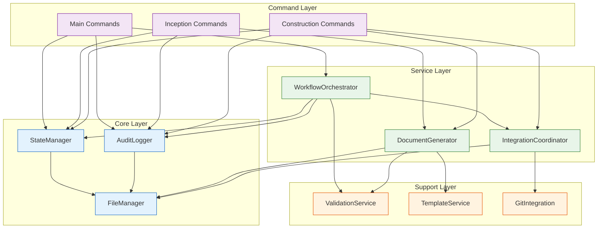
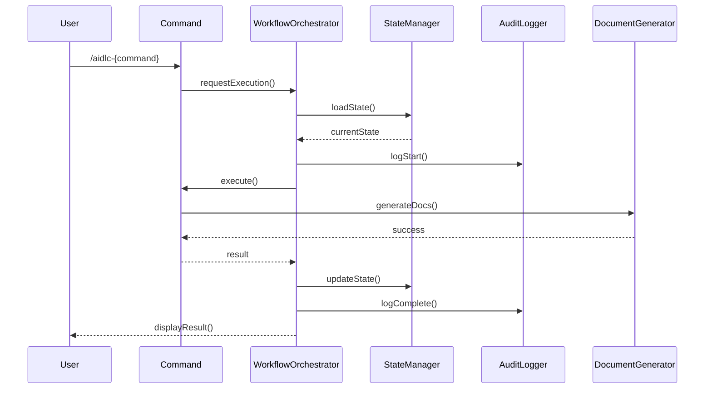
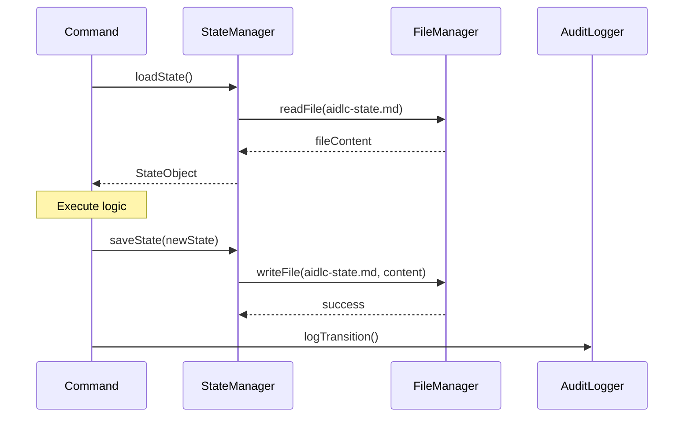
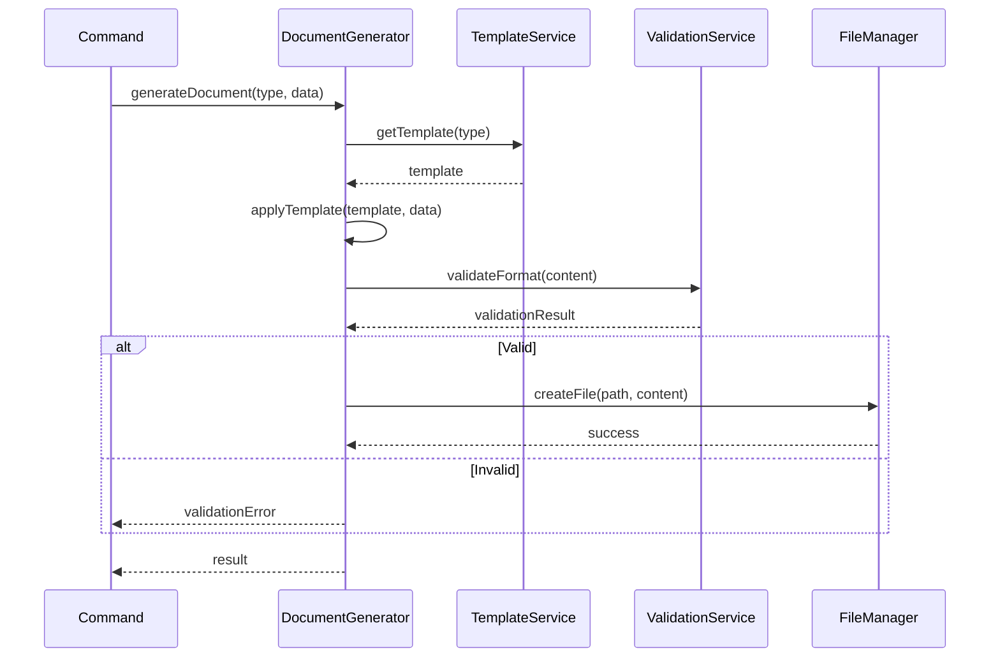
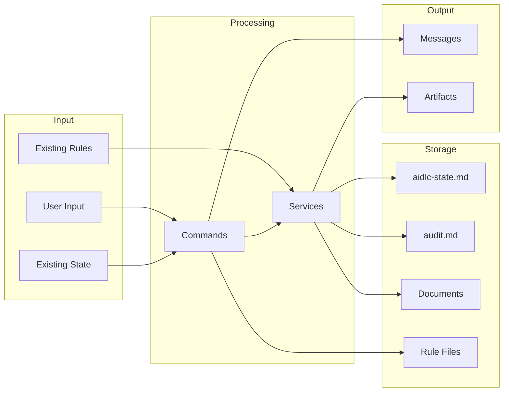
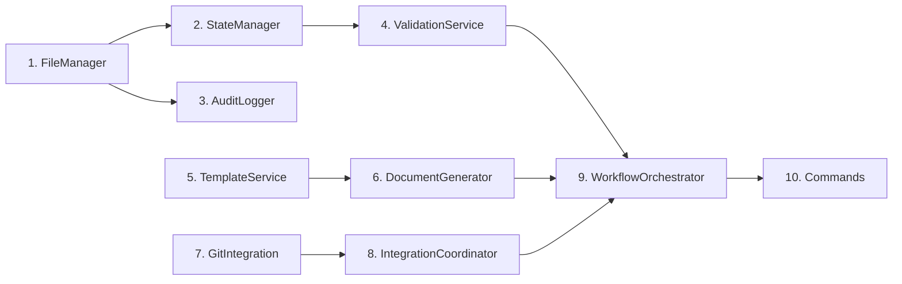

# Component Dependencies: AIDLC Command System

## Overview

เอกสารนี้แสดง dependency relationships และ communication patterns ระหว่าง components

---

## Dependency Matrix

### Core Layer Dependencies

| Component | Depends On | Used By |
|-----------|------------|---------|
| **StateManager** | FileManager | All Commands, WorkflowOrchestrator |
| **AuditLogger** | FileManager | All Commands, WorkflowOrchestrator |
| **FileManager** | - (Base) | StateManager, AuditLogger, DocumentGenerator |

### Command Layer Dependencies

| Component | Depends On | Uses |
|-----------|------------|------|
| **AidlcCommand** | StateManager, AuditLogger, FileManager | WorkflowOrchestrator |
| **InitCommand** | FileManager, StateManager, AuditLogger | - |
| **StatusCommand** | StateManager | - |
| **ReverseCommand** | StateManager, AuditLogger, FileManager | DocumentGenerator |
| **RequirementsCommand** | StateManager, AuditLogger, FileManager | DocumentGenerator |
| **StoriesCommand** | StateManager, AuditLogger, FileManager | DocumentGenerator |
| **PlanCommand** | StateManager, AuditLogger, FileManager | DocumentGenerator, ValidationService |
| **DesignCommand** | StateManager, AuditLogger, FileManager | DocumentGenerator |
| **UnitsCommand** | StateManager, AuditLogger, FileManager | DocumentGenerator |
| **FunctionalCommand** | StateManager, AuditLogger, FileManager | DocumentGenerator |
| **NfrCommand** | StateManager, AuditLogger, FileManager | DocumentGenerator |
| **InfraCommand** | StateManager, AuditLogger, FileManager | DocumentGenerator |
| **CodeCommand** | StateManager, AuditLogger, FileManager | DocumentGenerator, IntegrationCoordinator |
| **BuildCommand** | StateManager, AuditLogger, FileManager | DocumentGenerator |

### Service Layer Dependencies

| Component | Depends On | Used By |
|-----------|------------|---------|
| **WorkflowOrchestrator** | StateManager, AuditLogger, ValidationService, IntegrationCoordinator | All Commands |
| **DocumentGenerator** | FileManager, TemplateService, ValidationService | All Commands |
| **IntegrationCoordinator** | FileManager, GitIntegration | CodeCommand, WorkflowOrchestrator |

### Support Layer Dependencies

| Component | Depends On | Used By |
|-----------|------------|---------|
| **ValidationService** | - | WorkflowOrchestrator, DocumentGenerator, PlanCommand |
| **TemplateService** | - | DocumentGenerator |
| **GitIntegration** | - | IntegrationCoordinator |

---

## Dependency Graph



---

## Communication Patterns

### Pattern 1: Command Execution Flow



### Pattern 2: State Management Flow



### Pattern 3: Document Generation Flow



---

## Data Flow Diagram



---

## Circular Dependency Prevention

### Rules
1. **Core Layer**: ไม่ depend on Service หรือ Command layers
2. **Service Layer**: Depend on Core, Support เท่านั้น
3. **Command Layer**: Depend on Core, Service, Support
4. **Support Layer**: ไม่ depend on ใครเลย (Base utilities)

### Dependency Direction
```
Support Layer ← Core Layer ← Service Layer ← Command Layer
```

---

## Component Initialization Order



### Initialization Sequence
1. **FileManager** - Base file operations
2. **StateManager** - Depends on FileManager
3. **AuditLogger** - Depends on FileManager
4. **ValidationService** - Standalone
5. **TemplateService** - Standalone
6. **DocumentGenerator** - Depends on FileManager, TemplateService
7. **GitIntegration** - Standalone (optional)
8. **IntegrationCoordinator** - Depends on FileManager, GitIntegration
9. **WorkflowOrchestrator** - Depends on StateManager, ValidationService, IntegrationCoordinator
10. **Commands** - Depends on all services

---

## Error Propagation

### Error Flow
```
Component Error → Service Layer → WorkflowOrchestrator → Command → User
                       ↓
                 AuditLogger (log error)
```

### Error Handling Responsibilities

| Layer | Responsibility |
|-------|---------------|
| **Core** | Throw specific errors (FileNotFound, StateCorrupt) |
| **Service** | Catch, log, rethrow with context |
| **Command** | Catch, format user-friendly message |
| **User** | See formatted error with suggested action |

---

## Document History

| Version | Date | Changes |
|---------|------|---------|
| 1.0 | 2025-12-15 | Initial component dependency document |

