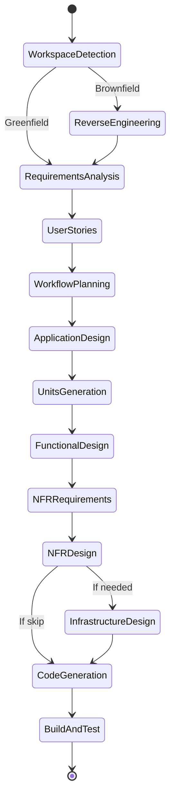
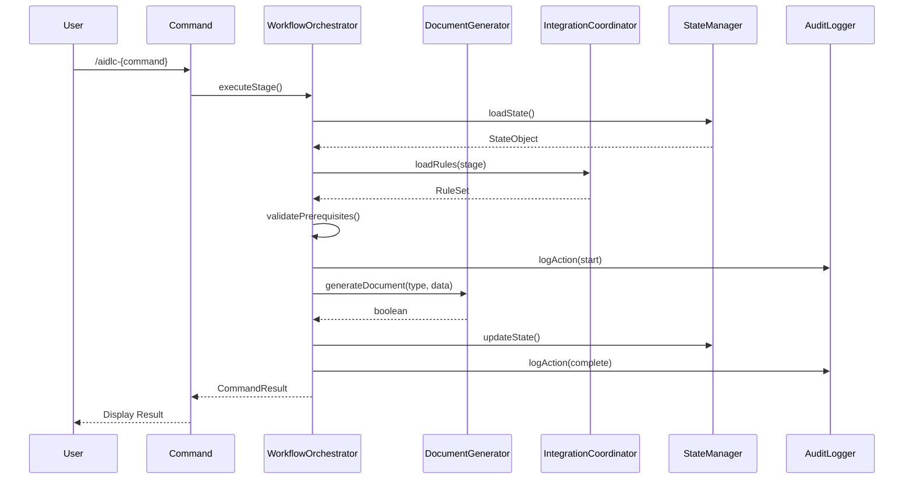

# Services: AIDLC Command System

## Overview

AIDLC Command System ใช้ Service Layer เพื่อ orchestrate การทำงานระหว่าง components

```
┌─────────────────────────────────────────────────────────────────┐
│                      Service Layer                               │
├─────────────────┬─────────────────┬─────────────────────────────┤
│  Workflow       │  Document       │      Integration            │
│  Orchestrator   │  Generator      │      Coordinator            │
│                 │                 │                             │
│ • Stage Control │ • Template Mgmt │ • Rules Integration         │
│ • Flow Routing  │ • Doc Creation  │ • Git Coordination          │
│ • State Sync    │ • Format Valid. │ • External Tools            │
└─────────────────┴─────────────────┴─────────────────────────────┘
```

---

## Service 1: WorkflowOrchestrator

### Purpose
Orchestrate AIDLC workflow stages และควบคุม flow ของ execution

### Responsibilities
1. **Stage Control**: ควบคุมการ transition ระหว่าง stages
2. **Flow Routing**: Route ไปยัง command ที่เหมาะสมตาม state
3. **State Synchronization**: Sync state ระหว่าง components
4. **Prerequisite Checking**: ตรวจสอบ prerequisites ก่อน execute stage

### Orchestration Pattern
```
User Input → Command → WorkflowOrchestrator → Component(s) → Output
                 ↓
           StateManager ← AuditLogger
```

### Key Operations

| Operation | Description | Components Involved |
|-----------|-------------|---------------------|
| `startWorkflow()` | เริ่ม AIDLC workflow | StateManager, AuditLogger |
| `executeStage(stage)` | Execute specific stage | StateManager, Command, AuditLogger |
| `transitionToNextStage()` | Transition to next stage | StateManager, ValidationService |
| `handleStageCompletion()` | Handle stage completion | StateManager, AuditLogger, GitIntegration |
| `validateTransition(from, to)` | Validate stage transition | ValidationService |

### Workflow State Machine



### Error Handling
- Invalid transition → Notify user with explanation
- Missing prerequisite → List required steps
- State corruption → Offer recovery options

---

## Service 2: DocumentGenerator

### Purpose
Generate และจัดการ AIDLC documents ทั้งหมด

### Responsibilities
1. **Template Management**: จัดการ document templates
2. **Document Creation**: สร้าง documents จาก templates
3. **Format Validation**: Validate document format (Markdown, Mermaid)
4. **Content Population**: Populate templates with data

### Document Types

| Type | Template | Output Location |
|------|----------|-----------------|
| State | state-template.md | `aidlc-docs/aidlc-state.md` |
| Audit | audit-template.md | `aidlc-docs/audit.md` |
| Requirements | requirements-template.md | `aidlc-docs/inception/requirements/` |
| Stories | stories-template.md | `aidlc-docs/inception/user-stories/` |
| Personas | personas-template.md | `aidlc-docs/inception/user-stories/` |
| Plans | plan-template.md | `aidlc-docs/inception/plans/` |
| Design | design-template.md | `aidlc-docs/inception/application-design/` |
| Units | units-template.md | `aidlc-docs/inception/application-design/` |
| Functional | functional-template.md | `aidlc-docs/construction/{unit}/` |
| NFR | nfr-template.md | `aidlc-docs/construction/{unit}/` |
| Code Plan | code-plan-template.md | `aidlc-docs/construction/plans/` |
| Build | build-template.md | `aidlc-docs/construction/build-and-test/` |

### Key Operations

| Operation | Description | Input | Output |
|-----------|-------------|-------|--------|
| `generateDocument(type, data)` | Generate document | DocType, DataObject | boolean |
| `validateFormat(doc)` | Validate document format | Document | ValidationResult |
| `applyTemplate(template, data)` | Apply template with data | Template, DataObject | string |
| `updateDocument(path, updates)` | Update existing document | string, Updates | boolean |

### Mermaid Validation Rules
- ต้อง validate syntax ก่อน save
- Support flowchart, sequenceDiagram, stateDiagram
- Apply consistent styling

---

## Service 3: IntegrationCoordinator

### Purpose
Coordinate integration กับ external systems และ existing AIDLC rules

### Responsibilities
1. **Rules Integration**: Load และ apply existing AIDLC rules
2. **Git Coordination**: Coordinate with Git for version control
3. **External Tools**: Interface with external tools

### Rules Integration

```
┌─────────────────────────────────────────────────────────────┐
│                  Integration Flow                            │
├─────────────────────────────────────────────────────────────┤
│                                                              │
│  .cursor/rules/aidlc-rules/                                 │
│       │                                                      │
│       ├── aws-aidlc-rules/core-workflow.mdc  ←── Main Rules │
│       │                                                      │
│       └── aws-aidlc-rule-details/                           │
│            ├── inception/      ←── Detailed Stage Rules     │
│            ├── construction/                                │
│            ├── operations/                                  │
│            └── common/         ←── Shared Rules             │
│                                                              │
│  IntegrationCoordinator                                     │
│       │                                                      │
│       └── Loads & Applies Rules to Commands                 │
│                                                              │
└─────────────────────────────────────────────────────────────┘
```

### Key Operations

| Operation | Description | Input | Output |
|-----------|-------------|-------|--------|
| `loadRules(type)` | Load AIDLC rules | RuleType | RuleSet |
| `applyRules(command, rules)` | Apply rules to command | Command, RuleSet | void |
| `validateRuleCompatibility()` | Check rule compatibility | - | ValidationResult |
| `coordinateGitCommit(stage)` | Coordinate Git commit | StageName | boolean |

### Rule Loading Strategy
1. Load core-workflow.mdc เป็น base rules
2. Load stage-specific rules จาก rule-details/
3. Load common rules (content-validation, error-handling)
4. Merge และ resolve conflicts

---

## Service Interaction Diagram



---

## Service Configuration

### WorkflowOrchestrator Config
```yaml
workflow:
  phases:
    - INCEPTION
    - CONSTRUCTION
    - OPERATIONS
  defaultStages:
    - workspace-detection
    - requirements-analysis
    - workflow-planning
    - code-generation
    - build-and-test
  conditionalStages:
    - reverse-engineering: brownfield_only
    - user-stories: if_user_facing
    - infrastructure-design: if_infra_needed
```

### DocumentGenerator Config
```yaml
documents:
  outputFormat: markdown
  mermaidValidation: true
  templatePath: internal
  timestampFormat: ISO8601
```

### IntegrationCoordinator Config
```yaml
integration:
  rulesPath: .cursor/rules/aidlc-rules/
  gitAutoCommit: optional
  externalTools: []
```

---

## Document History

| Version | Date | Changes |
|---------|------|---------|
| 1.0 | 2025-12-15 | Initial services document |

