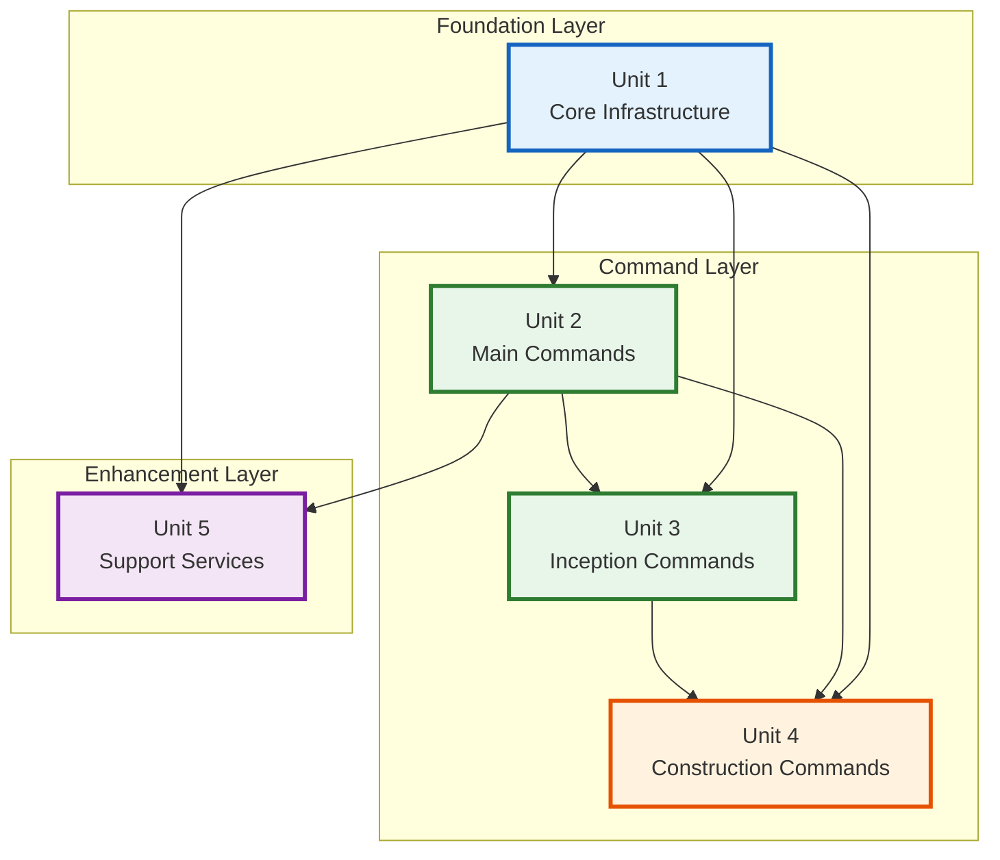
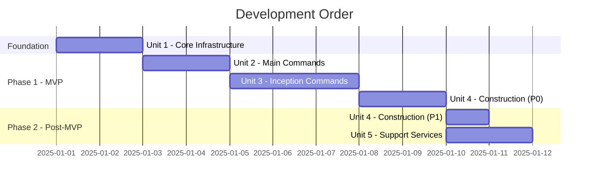
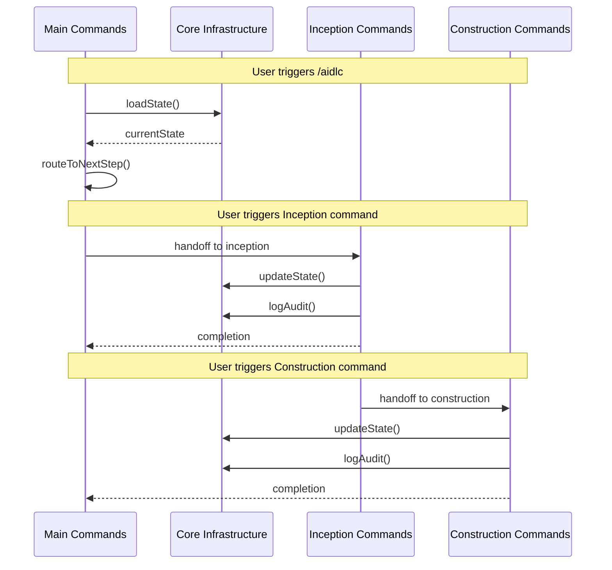

# Unit of Work Dependencies: AIDLC Command System

## Overview

เอกสารนี้แสดง dependencies ระหว่าง Units of Work และลำดับการพัฒนา

---

## Dependency Matrix

### Build Dependencies

| Unit | Depends On | Required By |
|------|------------|-------------|
| **1. Core Infrastructure** | - (Base) | All units |
| **2. Main Commands** | Unit 1 | Units 3, 4, 5 |
| **3. Inception Commands** | Units 1, 2 | Unit 4 |
| **4. Construction Commands** | Units 1, 2, 3 | Unit 5 |
| **5. Support Services** | Units 1, 2 | - (Enhancement) |

### Runtime Dependencies

| Unit | Uses At Runtime |
|------|-----------------|
| **1. Core Infrastructure** | None (standalone) |
| **2. Main Commands** | Unit 1 |
| **3. Inception Commands** | Units 1, 2 |
| **4. Construction Commands** | Units 1, 2, 3 |
| **5. Support Services** | Units 1, 2, 3, 4 |

---

## Dependency Graph



---

## Development Order

### Critical Path



### Development Phases

| Phase | Units | Duration | Milestone |
|-------|-------|----------|-----------|
| **Phase 0** | Unit 1 | 1 session | Core ready |
| **Phase 1** | Units 2, 3 | 2 sessions | INCEPTION commands ready |
| **Phase 2** | Unit 4 (P0) | 1 session | MVP complete |
| **Phase 3** | Unit 4 (P1), Unit 5 | 1 session | Full system ready |

---

## Inter-Unit Communication

### Communication Patterns



### Data Flow Between Units

| From | To | Data Passed |
|------|-----|-------------|
| Unit 1 | Unit 2 | State object, audit functions |
| Unit 2 | Unit 3 | Workflow context, next stage |
| Unit 3 | Unit 4 | Design artifacts, unit definitions |
| Unit 4 | Unit 5 | Generated code, validation requests |
| Unit 5 | All | Validation results, templates |

---

## Shared Resources

### Shared Files

| Resource | Owner | Consumers |
|----------|-------|-----------|
| `aidlc-state.md` | Unit 1 | All units |
| `audit.md` | Unit 1 | All units |
| `aidlc-docs/` structure | Unit 2 | All units |
| Existing AIDLC rules | External | All units |

### Shared Patterns

| Pattern | Defined In | Used By |
|---------|------------|---------|
| State loading/saving | Unit 1 | Units 2, 3, 4, 5 |
| Audit logging | Unit 1 | Units 2, 3, 4, 5 |
| Document generation | Unit 5 | Units 3, 4 |
| Approval workflow | Unit 5 | Units 3, 4 |
| Mermaid generation | Unit 5 | Units 3 |

---

## Integration Points

### Unit 1 ↔ Unit 2
```
┌─────────────────┐     ┌─────────────────┐
│  Main Commands  │────▶│ Core Infra      │
│                 │     │                 │
│  - /aidlc       │     │  - loadState()  │
│  - /aidlc-init  │◀────│  - saveState()  │
│  - /aidlc-status│     │  - logAudit()   │
└─────────────────┘     └─────────────────┘
```

### Unit 2 ↔ Unit 3
```
┌─────────────────┐     ┌─────────────────┐
│  Main Commands  │────▶│ Inception Cmds  │
│                 │     │                 │
│  - route to     │     │  - execute()    │
│    inception    │◀────│  - complete()   │
│                 │     │                 │
└─────────────────┘     └─────────────────┘
```

### Unit 3 ↔ Unit 4
```
┌─────────────────┐     ┌─────────────────┐
│ Inception Cmds  │────▶│ Construction    │
│                 │     │                 │
│  - design       │     │  - code()       │
│  - units        │◀────│  - build()      │
│                 │     │                 │
└─────────────────┘     └─────────────────┘
```

---

## Backward Compatibility

### Breaking Changes Policy

| Change Type | Impact | Handling |
|-------------|--------|----------|
| State format change | All units | Migration script in Unit 1 |
| Command rename | User workflows | Alias in old command |
| Audit format change | Audit reading | Version field in audit |
| Rule structure change | All commands | Compatibility layer |

### Version Compatibility Matrix

| Unit 1 Version | Compatible Unit 2 | Compatible Unit 3 |
|----------------|-------------------|-------------------|
| 1.0.x | 1.0.x | 1.0.x |
| 1.1.x | 1.0.x, 1.1.x | 1.0.x, 1.1.x |

---

## Testing Strategy by Unit

| Unit | Test Type | Dependencies Mocked |
|------|-----------|---------------------|
| Unit 1 | Unit tests | File system |
| Unit 2 | Unit + Integration | Unit 1 |
| Unit 3 | Unit + Integration | Units 1, 2 |
| Unit 4 | Unit + Integration | Units 1, 2, 3 |
| Unit 5 | Unit + Integration | Units 1, 2 |

---

## Document History

| Version | Date | Changes |
|---------|------|---------|
| 1.0 | 2025-12-15 | Initial unit dependency document |

