# Unit of Work Story Map: AIDLC Command System

## Overview

เอกสารนี้ map User Stories ไปยัง Units of Work สำหรับการ implement

---

## Story-to-Unit Mapping

### Unit 1: Core Infrastructure

| Story ID | Story Title | Priority |
|----------|-------------|----------|
| - | (Internal infrastructure - no direct user stories) | P0 |

**Note**: Core Infrastructure เป็น internal component ที่ support user-facing stories ใน Units อื่น

---

### Unit 2: Main Commands

| Story ID | Story Title | Priority |
|----------|-------------|----------|
| 1.1.1 | Start New AIDLC Workflow | P0 |
| 1.1.2 | Resume Existing AIDLC Workflow | P0 |
| 1.1.3 | Handle Workspace Detection Errors | P1 |
| 1.2.1 | Initialize Greenfield Project | P0 |
| 1.2.2 | Initialize Brownfield Project | P0 |
| 1.2.3 | Initialize with Team Configuration | P1 |
| 1.2.4 | Handle Initialization Errors | P2 |
| 1.3.1 | View Current Status | P0 |
| 1.3.2 | View Detailed Progress Report | P1 |
| 1.3.3 | Export Status Report | P2 |

**Total Stories**: 10  
**P0 Stories**: 5

---

### Unit 3: Inception Commands

| Story ID | Story Title | Priority | Command |
|----------|-------------|----------|---------|
| 2.1.1 | Analyze Existing Codebase | P0 | /aidlc-reverse |
| 2.1.2 | Skip Reverse Engineering for Greenfield | P0 | /aidlc-reverse |
| 2.2.1 | Analyze User Request | P0 | /aidlc-requirements |
| 2.2.2 | Handle Vague Requirements | P0 | /aidlc-requirements |
| 2.3.1 | Generate User Stories | P0 | /aidlc-stories |
| 2.3.2 | Skip Stories for Simple Tasks | P1 | /aidlc-stories |
| 2.4.1 | Generate Workflow Plan | P0 | /aidlc-plan |
| 2.4.2 | Customize Workflow | P1 | /aidlc-plan |
| 2.5.1 | Design Application Components | P0 | /aidlc-design |
| 2.6.1 | Generate Units of Work | P0 | /aidlc-units |

**Total Stories**: 10  
**P0 Stories**: 8

---

### Unit 4: Construction Commands

| Story ID | Story Title | Priority | Command |
|----------|-------------|----------|---------|
| 3.1.1 | Design Business Logic | P1 | /aidlc-functional |
| 3.2.1 | Define NFR Requirements | P1 | /aidlc-nfr |
| 3.3.1 | Design Infrastructure | P2 | /aidlc-infra |
| 3.4.1 | Generate Code for Unit | P0 | /aidlc-code |
| 3.4.2 | Handle Code Generation Errors | P1 | /aidlc-code |
| 3.5.1 | Run Build Process | P0 | /aidlc-build |

**Total Stories**: 6  
**P0 Stories**: 2

---

### Unit 5: Support Services

| Story ID | Story Title | Priority | Component |
|----------|-------------|----------|-----------|
| 4.1.1 | Track AIDLC Artifacts in Git | P1 | GitIntegration |
| 4.1.2 | Auto-commit on Stage Completion | P2 | GitIntegration |
| 4.2.1 | Load Existing AIDLC Rules | P0 | IntegrationCoordinator |
| 4.2.2 | Validate Rules Compatibility | P2 | ValidationService |
| 5.1.1 | Generate Project Documentation | P1 | DocumentGenerator |
| 5.2.1 | Generate Progress Reports | P1 | DocumentGenerator |

**Total Stories**: 6  
**P0 Stories**: 1

---

## Summary by Unit

| Unit | Total Stories | P0 | P1 | P2 |
|------|--------------|----|----|----| 
| 1. Core Infrastructure | 0 | 0 | 0 | 0 |
| 2. Main Commands | 10 | 5 | 3 | 2 |
| 3. Inception Commands | 10 | 8 | 2 | 0 |
| 4. Construction Commands | 6 | 2 | 2 | 2 |
| 5. Support Services | 6 | 1 | 3 | 2 |
| **Total** | **32** | **16** | **10** | **6** |

---

## Story Coverage Matrix

### By Epic

| Epic | Stories | Units Involved |
|------|---------|----------------|
| EPIC 1: Workflow Management | 10 | Units 1, 2 |
| EPIC 2: INCEPTION Commands | 10 | Units 1, 3 |
| EPIC 3: CONSTRUCTION Commands | 6 | Units 1, 4 |
| EPIC 4: Integration Features | 4 | Units 1, 5 |
| EPIC 5: Documentation Features | 2 | Unit 5 |

### By Persona

| Persona | Primary Stories | Units |
|---------|-----------------|-------|
| Solo Developer | 1.1.1, 1.2.1, 2.2.1, 2.3.1, 2.4.1, 3.4.1 | 2, 3, 4 |
| Team Lead | 1.2.3, 1.3.2, 2.4.2, 3.2.1, 5.2.1 | 2, 3, 4, 5 |
| Team Member | 1.1.2, 1.3.1, 2.2.2, 3.4.1, 3.5.1 | 2, 3, 4 |

---

## Implementation Priority

### MVP Implementation Order

```
Phase 0: Foundation
└── Unit 1: Core Infrastructure (no direct stories, but required)

Phase 1: Core Workflow
├── Unit 2 (P0 stories): 1.1.1, 1.1.2, 1.2.1, 1.2.2, 1.3.1
└── Unit 3 (P0 stories): 2.1.1, 2.1.2, 2.2.1, 2.2.2, 2.3.1, 2.4.1, 2.5.1, 2.6.1

Phase 2: Construction Core
└── Unit 4 (P0 stories): 3.4.1, 3.5.1
    + Unit 5: 4.2.1

Phase 3: Enhancements (P1)
├── Unit 2: 1.1.3, 1.2.3, 1.3.2
├── Unit 3: 2.3.2, 2.4.2
├── Unit 4: 3.1.1, 3.2.1, 3.4.2
└── Unit 5: 4.1.1, 5.1.1, 5.2.1

Phase 4: Future (P2)
├── Unit 2: 1.2.4, 1.3.3
├── Unit 4: 3.3.1
└── Unit 5: 4.1.2, 4.2.2
```

---

## Story Dependencies

### Dependency Chain

```mermaid
graph LR
    subgraph Unit2["Unit 2: Main Commands"]
        S111["1.1.1 Start Workflow"]
        S121["1.2.1 Init Greenfield"]
        S131["1.3.1 View Status"]
    end
    
    subgraph Unit3["Unit 3: Inception"]
        S221["2.2.1 Analyze Request"]
        S231["2.3.1 Generate Stories"]
        S241["2.4.1 Generate Plan"]
        S251["2.5.1 Design Components"]
        S261["2.6.1 Generate Units"]
    end
    
    subgraph Unit4["Unit 4: Construction"]
        S341["3.4.1 Generate Code"]
        S351["3.5.1 Build Process"]
    end
    
    S111 --> S121
    S121 --> S221
    S221 --> S231
    S231 --> S241
    S241 --> S251
    S251 --> S261
    S261 --> S341
    S341 --> S351
    
    S131 -.-> S111
    
    style S111 fill:#E8F5E9
    style S121 fill:#E8F5E9
    style S131 fill:#E8F5E9
    style S221 fill:#E3F2FD
    style S231 fill:#E3F2FD
    style S241 fill:#E3F2FD
    style S251 fill:#E3F2FD
    style S261 fill:#E3F2FD
    style S341 fill:#FFF3E0
    style S351 fill:#FFF3E0
```



---

## Acceptance Criteria Coverage

### Stories with Gherkin AC
- 1.1.1, 1.2.2, 2.1.2, 2.3.2, 4.1.2

### Stories with Checklist AC
- 1.1.2, 1.2.1, 1.2.3, 1.3.1, 2.2.1, 2.3.1, 2.4.1, 2.5.1, 2.6.1, 3.1.1, 3.2.1, 3.3.1, 3.4.1, 3.5.1, 4.1.1, 4.2.1, 5.1.1, 5.2.1

### Stories with Scenario AC
- 1.1.3, 1.2.4, 2.2.2, 3.4.2, 4.2.2

---

## Document History

| Version | Date | Changes |
|---------|------|---------|
| 1.0 | 2025-12-15 | Initial story map document |

