# Execution Plan: AIDLC Command System

## Project Overview

| Attribute | Value |
|-----------|-------|
| **Project Name** | AIDLC Command System for Cursor |
| **Project Type** | Greenfield |
| **Complexity** | Complex |
| **Start Date** | 2025-12-15 |

---

## Detailed Analysis Summary

### Change Impact Assessment
- **User-facing changes**: Yes - New chat commands for end users
- **Structural changes**: Yes - New command architecture and file structure
- **Data model changes**: Yes - State tracking and audit logging
- **API changes**: No - No external APIs (internal commands only)
- **NFR impact**: Yes - Performance, usability, maintainability

### Risk Assessment
- **Risk Level**: Medium
- **Rollback Complexity**: Easy (file-based, no external dependencies)
- **Testing Complexity**: Medium (command interactions need verification)

---

## Workflow Visualization

```mermaid
flowchart TD
    Start(["🚀 User Request"])
    
    subgraph INCEPTION["🔵 INCEPTION PHASE"]
        WD["Workspace Detection<br/><b>✅ COMPLETED</b>"]
        RE["Reverse Engineering<br/><b>⏭️ SKIPPED</b>"]
        RA["Requirements Analysis<br/><b>✅ COMPLETED</b>"]
        US["User Stories<br/><b>✅ COMPLETED</b>"]
        WP["Workflow Planning<br/><b>✅ COMPLETED</b>"]
        AD["Application Design<br/><b>⏳ EXECUTE</b>"]
        UG["Units Generation<br/><b>⏳ EXECUTE</b>"]
    end
    
    subgraph CONSTRUCTION["🟢 CONSTRUCTION PHASE"]
        FD["Functional Design<br/><b>⏳ EXECUTE</b>"]
        NFRA["NFR Requirements<br/><b>⏳ EXECUTE</b>"]
        NFRD["NFR Design<br/><b>⏳ EXECUTE</b>"]
        ID["Infrastructure Design<br/><b>⏭️ SKIP</b>"]
        CG["Code Generation<br/><b>⏳ EXECUTE</b>"]
        BT["Build and Test<br/><b>⏳ EXECUTE</b>"]
    end
    
    subgraph OPERATIONS["🟡 OPERATIONS PHASE"]
        OPS["Operations<br/><b>📋 PLACEHOLDER</b>"]
    end
    
    Start --> WD
    WD --> RE
    RE -.->|Greenfield| RA
    RA --> US
    US --> WP
    WP --> AD
    AD --> UG
    UG --> FD
    FD --> NFRA
    NFRA --> NFRD
    NFRD --> ID
    ID -.->|Skip| CG
    CG --> BT
    BT --> OPS
    OPS --> End(["✅ Complete"])
    
    style WD fill:#4CAF50,stroke:#1B5E20,stroke-width:3px,color:#fff
    style RE fill:#BDBDBD,stroke:#424242,stroke-width:2px,stroke-dasharray: 5 5,color:#000
    style RA fill:#4CAF50,stroke:#1B5E20,stroke-width:3px,color:#fff
    style US fill:#4CAF50,stroke:#1B5E20,stroke-width:3px,color:#fff
    style WP fill:#4CAF50,stroke:#1B5E20,stroke-width:3px,color:#fff
    style AD fill:#FFA726,stroke:#E65100,stroke-width:3px,stroke-dasharray: 5 5,color:#000
    style UG fill:#FFA726,stroke:#E65100,stroke-width:3px,stroke-dasharray: 5 5,color:#000
    style FD fill:#FFA726,stroke:#E65100,stroke-width:3px,stroke-dasharray: 5 5,color:#000
    style NFRA fill:#FFA726,stroke:#E65100,stroke-width:3px,stroke-dasharray: 5 5,color:#000
    style NFRD fill:#FFA726,stroke:#E65100,stroke-width:3px,stroke-dasharray: 5 5,color:#000
    style ID fill:#BDBDBD,stroke:#424242,stroke-width:2px,stroke-dasharray: 5 5,color:#000
    style CG fill:#FFA726,stroke:#E65100,stroke-width:3px,stroke-dasharray: 5 5,color:#000
    style BT fill:#FFA726,stroke:#E65100,stroke-width:3px,stroke-dasharray: 5 5,color:#000
    style OPS fill:#FFF59D,stroke:#F57F17,stroke-width:2px,color:#000
    style Start fill:#CE93D8,stroke:#6A1B9A,stroke-width:3px,color:#000
    style End fill:#CE93D8,stroke:#6A1B9A,stroke-width:3px,color:#000
    
    style INCEPTION fill:#BBDEFB,stroke:#1565C0,stroke-width:2px
    style CONSTRUCTION fill:#C8E6C9,stroke:#2E7D32,stroke-width:2px
    style OPERATIONS fill:#FFF59D,stroke:#F57F17,stroke-width:2px
```

---

## Phases to Execute

### 🔵 INCEPTION PHASE

| Stage | Status | Rationale |
|-------|--------|-----------|
| Workspace Detection | ✅ COMPLETED | Project initialized as Greenfield |
| Reverse Engineering | ⏭️ SKIPPED | Not needed for Greenfield project |
| Requirements Analysis | ✅ COMPLETED | Requirements documented with 14 commands |
| User Stories | ✅ COMPLETED | 28 stories with 3 personas |
| Workflow Planning | ✅ COMPLETED | This document |
| **Application Design** | ⏳ EXECUTE | Need to design 14 command components and their methods |
| **Units Generation** | ⏳ EXECUTE | Need to decompose into MVP and Post-MVP units |

### 🟢 CONSTRUCTION PHASE

| Stage | Status | Rationale |
|-------|--------|-----------|
| **Functional Design** | ⏳ EXECUTE | Business rules for commands need definition |
| **NFR Requirements** | ⏳ EXECUTE | Performance and usability requirements exist |
| **NFR Design** | ⏳ EXECUTE | NFR patterns need incorporation |
| Infrastructure Design | ⏭️ SKIP | No cloud infrastructure (local Cursor Rules) |
| **Code Generation** | ⏳ EXECUTE | Generate .mdc command files |
| **Build and Test** | ⏳ EXECUTE | Verify commands work correctly |

### 🟡 OPERATIONS PHASE

| Stage | Status | Rationale |
|-------|--------|-----------|
| Operations | 📋 PLACEHOLDER | Future deployment workflows |

---

## MVP Implementation Scope

### Phase 1: Core Commands (MVP)
| Command | Priority | Description |
|---------|----------|-------------|
| `/aidlc` | P0 | Main entry point |
| `/aidlc-init` | P0 | Project initialization |
| `/aidlc-status` | P0 | Status display |

### Phase 2: Inception Commands
| Command | Priority | Description |
|---------|----------|-------------|
| `/aidlc-requirements` | P0 | Requirements analysis |
| `/aidlc-stories` | P0 | User stories generation |
| `/aidlc-plan` | P0 | Workflow planning |
| `/aidlc-design` | P0 | Application design |
| `/aidlc-units` | P0 | Units generation |

### Phase 3: Construction Commands
| Command | Priority | Description |
|---------|----------|-------------|
| `/aidlc-code` | P0 | Code generation |
| `/aidlc-build` | P0 | Build and test |
| `/aidlc-functional` | P1 | Functional design |
| `/aidlc-nfr` | P1 | NFR requirements & design |
| `/aidlc-infra` | P2 | Infrastructure design |
| `/aidlc-reverse` | P0 | Reverse engineering |

---

## Estimated Timeline

| Phase | Stages | Duration |
|-------|--------|----------|
| INCEPTION (remaining) | Application Design, Units Generation | ~30 min |
| CONSTRUCTION | Functional, NFR, Code, Build | ~2 hours |
| **Total Remaining** | **7 stages** | **~2.5 hours** |

---

## Success Criteria

### Primary Goal
Working AIDLC command system for Cursor with all P0 commands functional

### Key Deliverables
- [ ] 14 `.mdc` command files in `.cursor/rules/aidlc-commands/`
- [ ] Core workflow integration with existing AIDLC rules
- [ ] State tracking via `aidlc-state.md`
- [ ] Audit logging via `audit.md`
- [ ] Project scaffolding templates

### Quality Gates
- [ ] All P0 commands execute without errors
- [ ] Commands follow AIDLC workflow sequence
- [ ] State persistence works across sessions
- [ ] Audit trail captures all user interactions

---

## Document History

| Version | Date | Changes |
|---------|------|---------|
| 1.0 | 2025-12-15 | Initial execution plan |

